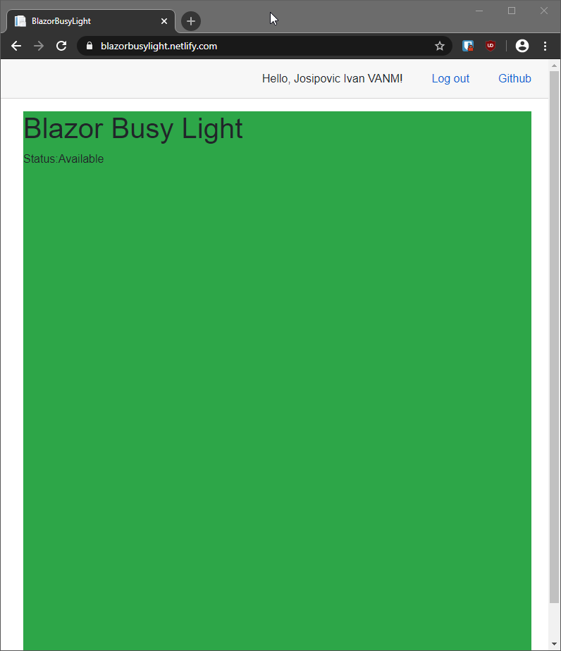

# [BlazorBusyLight.netlify.com](https://blazorbusylight.netlify.com/)

## What is this?
BlazorBusyLight is a web based Microsoft Teams [Busy Light](https://busylight.com/).

Simply navigate to the [website](https://blazorbusylight.netlify.com/) using an old phone or tablet and you can repuprose it as a busy light.

Hopefully this can help keep the kids out the office :)

